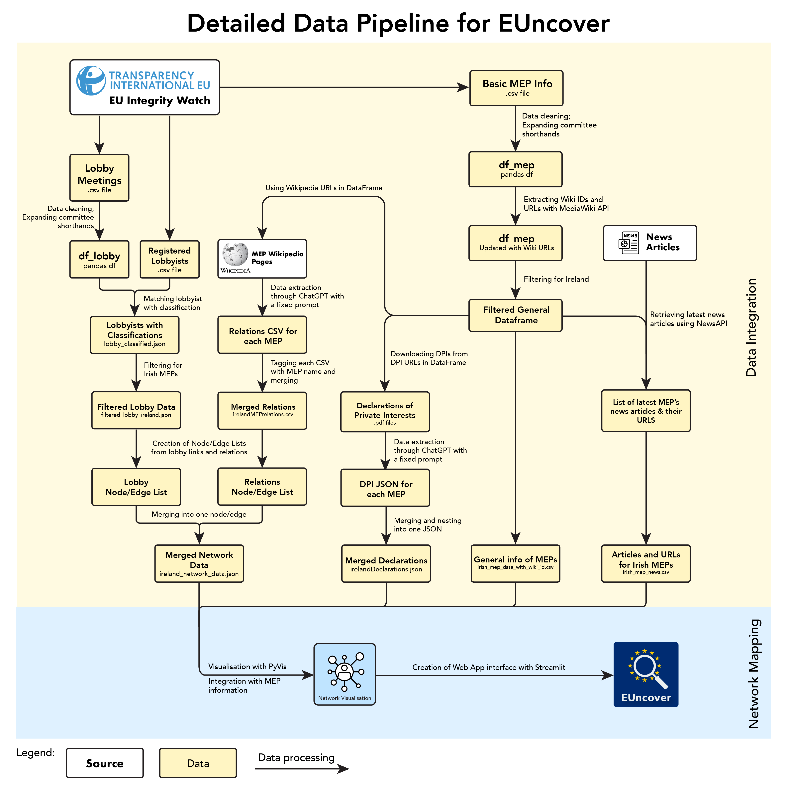

# EUncover: Exploring EU Political Networks

## 🌍 About EUncover
EUncover is a **student-led web application** developed as part of the **Data Sprint course** for the **MA Cultural Data & AI** at the **University of Amsterdam**. This project was created to provide **greater transparency** and **accessibility** to the complex networks of influence shaping European policy.

👩‍💻 Website and code created by:
- **Julia Jasińska**  

🤝 Our Team and contributions:
- **Julia Jasińska** - Website development and design, Data management and analysis lead, Data integration, structuring and cleaning (all), Final notebook
- **Mike Chow** - Graphic design (Data Pipelines), Literature Review (Methodology), Data cleaning and structuring (EU Integrity Watch, Final notebook)
- **Julia Vos** - Project chairperson, Data collection and cleaning (Wikipedia)
- **Renzo Pos** - AI utilization and prototyping, Data cleaning and structuring (EP Website, EU Integrity Watch, Wikipedia)
- **Royanne Ng** - API scraping (Wikipedia), Data collection and cleaning (Wikipedia), Copyediting
- **Lykke Winther-Bay** - API scraping, Data collection and structuring (News), Core Literature Review
 

## 🚀 Try It Now
No installation is required! Simply visit the **EUncover web app** on **Streamlit Community Cloud**:  
🔗 [Click Here to Access EUncover](https://your-streamlit-app-link.com)

## 🎯 Project Objectives
EUncover aims to:
- Visualize relationships between **MEPs, their family members, lobbyists, political organizations, and other stakeholders**.
- Allow users to **interactively explore** these networks.
- Provide insights into offically declared information, **lobbying connections** and **recent news**.
- Consolidate important infomrmation about MEPs in one place. 

## 📊 Data Sources
The data presented on this website is obtained from:
- **[Integrity Watch EU](https://www.integritywatch.eu/)**
- **European Parliament Transparency Registers**
- **Public Open Data Portals**
- **Wikipedia and Media Wiki API**
  
All data is **structured and processed** to create meaningful **network visualizations** and dynamic display of information. 

# Project Structure
- webapp.py
- README.md
- data/
  - ireland_network_data.json
  - irelandDeclarations.json
  - irelandMEPbio.csv
  - irelandMEPnews.csv
  - logo.svg
  - pipeline_detailed.png
  

## 🛠 How to Use EUncover

### 1️⃣ Select a Name
- Choose a **Member of the European Parliament (MEP)** from the dropdown list in the Search bar.
- For the scope of this project, **only Irish EU MEPs** will be displayed.

### 2️⃣ Explore the Network and Background Information
- **Interact with the visual network** displaying relationships between the chosen MEP and **their family members, lobbyists, political organizations, think tanks, and other affiliated entities**.
- **Zoom in and out** to navigate the graph.
- **Hover over nodes** to view details about each entity.
- **Click on edges** to view the nature of the relationship *(e.g., lobbying meetings, financial connections, institutional roles).*
- Explore different connections and consider potential influences in **EU policymaking**.

### 3️⃣ Discover Additional Information
- At the **top of the page and in the sidebars**, you will find:
  - **Official declarations** made by the MEP.
  - **Recent news articles** related to the MEP.
  - **Other relevant links**.
- **Analyze** whether there are similarities between **the Network and Official Declarations by the MEP**.
 

## ⚠️ Disclaimer
EUncover is a **student research project**, and while we strive for accuracy, the data may have **limitations, biases, or missing information**. The visualizations are based on **publicly available data**, and we encourage further investigation into the relationships presented.  
We do not accuse anyone for corruption, we only aim to provide a space where EU citizens can easly compare available information. 

## 🤝 Contributions
Since this is an academic project, contributions are not actively sought. However, feedback is welcome! Feel free to **open an issue** or reach out if you have suggestions.

## 📩 Contact
For inquiries or feedback, contact me at julia.jasinska@student.uva.nl . We’d love to hear your thoughts!

📌 **University of Amsterdam | MA Cultural Data & AI | Data Sprint Project**
